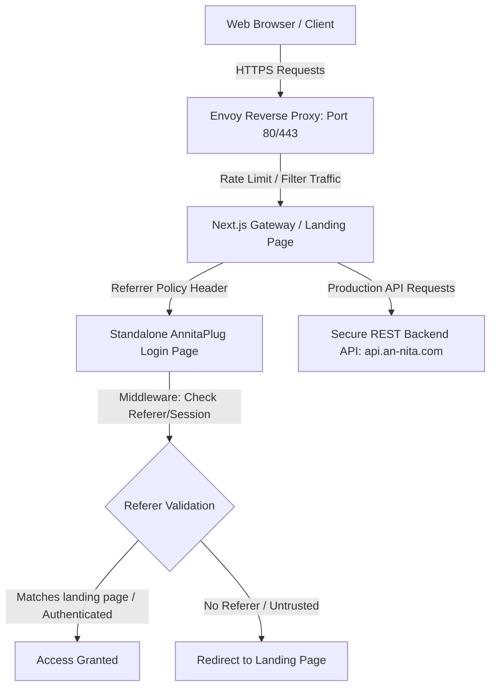

# 🛡️ Annita Landing Page & Gateway Portal
> **FORTUNE 500 / PENTAGON-LEVEL HIGH-SECURITY ENTERPRISE SPECIFICATION**

[](https://nextjs.org/)
[](#)
[](https://vercel.com/)
[](#)

This repository houses the production-ready marketing website, enterprise portal, and security gateway for **Annita LLC**. Serving as the official entry point (landing page) for the Annita ecosystem, this project hosts high-performance marketing pages, dynamic solution request pipelines, and acts as the gatekeeper directing traffic securely to the standalone **AnnitaPlug** application.

---

## 🏛️ System & Security Architecture



### 🔒 Core Security Controls

1. **Referer Verification Gate (Client Middleware)**:
   - Access to the standalone **AnnitaPlug** login route (`/login`) is locked down at the edge via Next.js middleware.
   - The middleware inspects the `Referer` header of incoming requests. Direct traffic or untrusted domains are blocked and redirected to the landing page domain (`https://www.an-nita.com`), preventing bypass of the gateway portal.
   
2. **Envoy Reverse Proxy & Rate Limiting**:
   - Pre-configured Envoy proxy settings inside the `envoy/` directory protect the gateway from Distributed Denial of Service (DDoS) and automated brute-force scripts.
   - Includes rate-limiting configuration rules (`ratelimit-config.yaml`) mapping client connection quotas before hitting server runtimes.

3. **Zero-Trust Secret Isolation (Pentagon-Grade `.gitignore`)**:
   - Engineered to strictly block credential leakage by ignoring all local environment variables (`*.env`, `*.env.local`), database engines (`*.sqlite`, `*.db`), private keys/keysets (`*.pem`, `*.key`), diagnostic dumps, and developer-specific settings, while maintaining clean public-only configurations.

4. **Headers & Content Security Policy (CSP)**:
   - Configured with strict security headers (CORS control, Content Security Policy, Frame Options, Strict Transport Security) to protect browser instances and eliminate cross-site scripting (XSS) and clickjacking vectors.

---

## 🚀 Key Features

* **Interactive Live Coding Terminal**: Supports real-time execution logs for multithreaded systems (`annita_pay.ts`, `ezri_ai.py`, and `pulse_health.go`), including run script actions and state-saving parameters.
* **Session-Aware Loader**: Optimized loading sequencing checks `sessionStorage` to serve the bootscreen only on the initial page visit, bypassing it on subsequent tab navigation for instant loading.
* **Viewport-Triggered Stats**: Counter modules count up dynamically from `0` to real stats matching the company's verified global statistics when they enter the user's viewport.
* **Responsive Layout Spacing**: Standardized vertical spacing (`py-28`) across components ensures consistent visual flow on all mobile, tablet, and desktop screens.

---

## 📂 Project Structure

```
├── app/                       # Next.js App Router root directory
│   ├── about/                 # About Us and verified team stats
│   ├── awards/                # Global recognitions page
│   ├── contact/               # Contact support and location index
│   ├── contact-sales/         # Enterprise sales pipeline forms
│   ├── login/                 # Ecosystem redirect landing point
│   ├── solutions/             # Solutions catalog and request pipeline
│   │   ├── request/           # Multi-step solutions request form
│   │   └── page.tsx           # Solutions directory landing
│   ├── globals.css            # Global CSS custom properties and styles
│   ├── layout.tsx             # Root layout with metadata and site loader
│   └── page.tsx               # Homepage and interactive code playground
├── components/                # Reusable UI component modules
│   ├── live-coding-terminal.tsx # Tabbed script terminal emulator
│   ├── loader.tsx             # Spinning visual loader component
│   ├── site-loader-wrapper.tsx # Session-aware mounting container
│   ├── navigation.tsx         # Responsive sticky header navigation
│   └── theme-provider.tsx     # Custom hydration-safe theme wrapper
├── envoy/                     # Envoy reverse proxy configurations
│   ├── docker-compose.yml     # Standalone Envoy container config
│   ├── envoy.yaml             # Cluster and routing proxy layout
│   └── ratelimit-config.yaml  # Rate limits for inbound endpoint routes
├── lib/                       # Utility functions and API integrations
│   └── api.ts                 # Form submission helpers to production API
├── public/                    # Optimized logos, icons, and image assets
├── .env.example               # Standard mock environment configurations
├── .env.production            # Production endpoints for redirection and API
├── vercel.json                # Vercel routing parameters and build path settings
├── package.json               # Package dependencies and configuration
└── tsconfig.json              # TypeScript engine configurations
```

---

## 🛠️ Local Development & Setup

### Prerequisites
- Node.js (version 18.x or 20.x recommended)
- npm (version 10.x or above)

### 1. Installation
Clone the repository and navigate to the project directory:
```bash
cd Annita-Landing-Page
npm install
```

### 2. Configure Environment Variables
Create a `.env.local` file in the root folder (this file is ignored by Git):
```properties
# Development client app target
NEXT_PUBLIC_CLIENT_URL=http://localhost:3001

# Production / Mock API backend endpoint
NEXT_PUBLIC_API_URL=http://localhost:5000
```

### 3. Run Development Server
Start the local Next.js development server:
```bash
npm run dev
```
Open `http://localhost:3000` in your web browser.

### 4. Build for Production
Verify that the project compiles with no warnings or TypeScript errors:
```bash
npm run build
```
Start the production server locally:
```bash
npm run start
```

---

## 🌐 Deployment Configuration

The landing page website is configured to run as a standalone Next.js deployment. 

### Vercel Integration
To deploy to Vercel, link this directory as a Next.js project. The root [vercel.json](file:///d:/Annita%20v1.0-Web%20App/vercel.json) or repository-specific settings will direct traffic accordingly.

Ensure the following Environment Variables are configured in the Vercel dashboard:
- `NEXT_PUBLIC_CLIENT_URL` = `https://annita-v1.vercel.app` (The standalone client dashboard application)
- `NEXT_PUBLIC_API_URL` = `https://api.an-nita.com` (The production backend API endpoint)

---

## 🔒 Security Vulnerability Reporting

This repository operates under strict security guidelines. If you discover a vulnerability, do not open a public issue. Instead, report it immediately to our security response team at `security@an-nita.com`. All reports will receive an immediate response and will be triaged within 24 hours.
